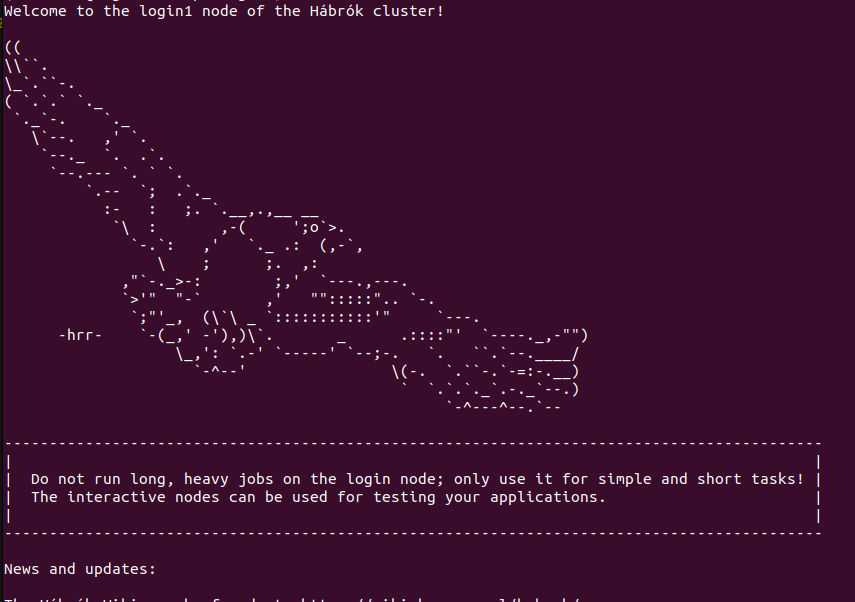

# Habrok Demo

Habrok is the university's very own HPC cluster. The documentation is publicly available [here](https://wiki.hpc.rug.nl/habrok/start). It is essentially a huge connection on hardware, which you can use to train your models way more efficiently than your very own laptop. The following demo assumes a Unix-based machine (Habrok runs only Linux anyway).

## Connecting to Habrok

Once you have an account, you can connect to Habrok using the following command:

```
ssh <your-s-number>@login1.hb.hpc.rug.nl
```

After this you need to type in your password and 2FA. This would connect you to [node](https://status.hpc.rug.nl/) `login1`. If you see something like this, you have successfully connected to Habrok:



Habrok runs ONLY Linux and ONLY on the command line (there is no user interface). Some super basic universal linux commands are

- `ls`: List the files in the present working directory
- `cd`: Change the directory (navigate the file system)
- `cat`: View the raw contents of a file
- `cp`: Copy file to a directory
- `mv`: Move/rename file
- `rm`: Delete file
- `nano`: Basic text editor that runs in the terminal

## Transferring files

There are 2 main ways to transfer files between your machine and the cluster

- `git`: Git is already installed. You can link your account and clone a repository as per usual
- `scp`: 'secure copy'. Tip: to see the present working directory on Habrok you can type `pwd`

Example with `scp`:

`scp s4362675@login1.hb.hpc.rug.nl:/home4/s4362675/torch-habrok-tutorial/demo.py .`

This would copy the `demo.py` script found in `/home4/s4362675/torch-habrok-tutorial/` to the current directory (denoted as `.`)

## Modules

Habrok has some preimplemented modules which are collections of packages that have been optimized for the cluster. Firstly, you should always load a module with python installed. You can check the available python versions using `module avail python`. Once you select a module, e.g. `Python/3.11.5-GCCcore-13.2.0`, you can load it as follows:

```
module load Python/3.11.5-GCCcore-13.2.0
```

From here, you can create a virtual environment as per usual (`python -m venv <your-environment-name>`) and install additional packages via `pip`. You should ALWAYS be in a virtual environment before using `pip`. There are all kinds of modules such as modules specific for PyTorch (try `module avail pytorch`). We recommend that you stick to only one module such as a regular python module to avoid the inevitable incompatibility issues. Some useful commands for modules:

- `module list`: shows all currently loaded modules
- `module avail`: shows all modules with a corresponding keyword
- `module spider`: shows more information about a specific module
- `module purge`: unloads all modules

## Jobs

Habrok really shines when code is running on a job. A job is essentially a single bash script (see .sh files in the repository for examples) that provides instructions on how your program should be run. The parameters of a job are defined with `#SBATCH`, read more about them in the documentation. The provided .sh files show simple jobs for a CPU, a GPU, an array of *n* jobs, and a [jupyter notebook](https://wiki.hpc.rug.nl/habrok/examples/jupyter). Feel free to use them as templates. These are the following basic commands related to jobs:

- `sbatch` submits a jobscript to the scheduler
- `squeue -u $USER` shows the status of your jobs
- `scancel` cancels a job provided a job id (first column of `squeue`)

The standard output of your job will be saved in a `slurm_*.out` file. You can use `cat` to check how your program is doing.

## Miscellaneous Tips & Tricks

1. You can use VS code's extension `Remote SSH` to open a folder from Habrok in VS code.
2. You can do `cd /scratch/$USER` to enter the `/scratch` directory, which provides 250GB space per user and powerful SSDs, which are extremely useful for tasks with huge datasets such as images.
3. Usually GPUs are in high demand, meaning that a job can be on the queue for hours. Once you submit the job (with `sbatch`) it will be queued and ran as soon as possible no matter what, even if you disconnect from the server. Even though the queue is long, the difference in performance often dramatically outweighs the waiting time.
4. Always make sure that your code is *device agnostic*, meaning that it should use a GPU if it is available but it shouldn't break otherwise. You can check if a GPU is available using `torch.cuda.is_available()`. This is a general common practice and is quite easy to implement.

## FAQ

This section will be filled throughout the course with common questions from you. Feel free to contact us if something is unclear.
